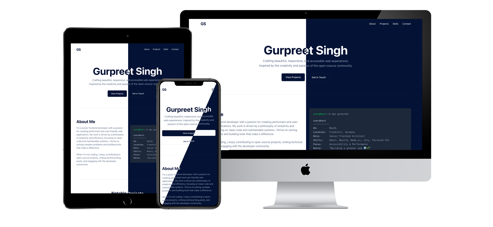

# 11ty Innovative Intro

This template can be used to create new resumes with 11ty.

See [Demo](https://11ty-innovative-intro.netlify.app)

## Deploy a fork of this template to Netlify:

## Features

- Fully Customizable
- Semantic HTML
- Theming with TailwindCSS (Dark/Light)
- Accessible (WCAG AA)
- Self-Contained (no external resources)
- Search Engine Optimized

### Lighthouse Performance Scores

### Screenshot

## Getting Started

- Run `npm start` for a development server and live reloading
- Run `npm run build` to generate a production build
